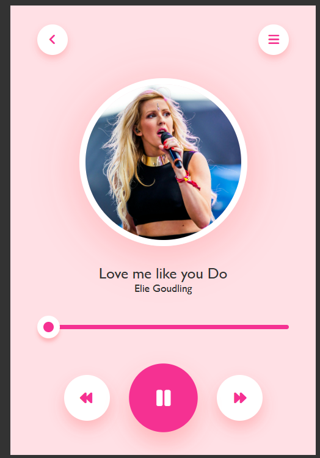

# 🎵 Music Player

A responsive **Music Player Web Application** built using **HTML, CSS, and JavaScript**.
This project allows users to play songs, pause music, move to the next or previous track, and control playback using an interactive progress bar.

The project demonstrates **JavaScript DOM manipulation and audio control functionality**.

---

## 🚀 Features

* ▶️ Play / Pause Music
* ⏭ Next Song
* ⏮ Previous Song
* 📊 Interactive Progress Bar
* 🎧 Smooth Audio Playback
* 📱 Responsive Design for different screen sizes

---

## 🛠️ Tech Stack

* **HTML** – Structure of the music player
* **CSS** – Styling and layout design
* **JavaScript** – Audio functionality and controls

---

## 📸 Preview



---

## 📂 Project Structure

```
Music-Player/
│
├── index.html        # Main HTML structure
├── style.css         # Styling of the music player
├── script.js         # JavaScript functionality
│
├── songs/            # Folder containing music files
├── images/           # Album art or icons (optional)
│
├── Screenshot.png.png  # Preview screenshot
└── README.md         # Project documentation
```

---

## ▶️ How to Run the Project

1. Clone the repository

```
git clone https://github.com/your-username/music-player.git
```

2. Open the project folder

3. Run the project by opening **index.html** in your browser

---

## 🎯 Learning Objectives

This project helped in understanding:

* JavaScript **Audio API**
* **DOM Manipulation**
* Handling **user interactions**
* Building **interactive web applications**

---

## 🔮 Future Improvements

* Add playlist functionality
* Add volume control
* Add shuffle and repeat options
* Add song duration display

---

## 👩‍💻 Author

**Priya**

Aspiring **Software Developer** interested in **Data Structures & Algorithms (Java) and Web Development**.

---

⭐ If you like this project, consider giving it a **star on GitHub!**
